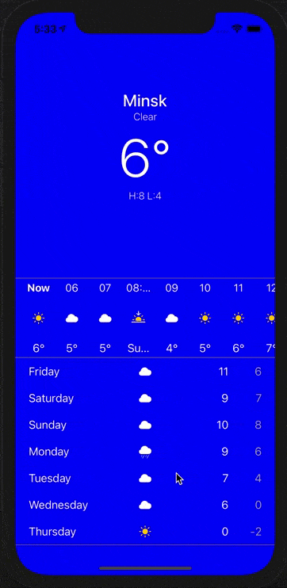

# WeatherApp
Test task for Resliv
Working with OpenWeatherMapApi
## How it looks

## What works now

1. Getting data from API
1. Parsing to models
1. Visualisation of them on main screen
1. Scrolling and adapting most of uiviews to it

## What needs to be done

1. Saving data
1. Hourly collection view cells size
1. Probability of precipitation for table view daily section and hourly collection view
1. All icons state
1. View Background
1. User settings
1. Add more cities, saving them
1. etc...

### P.S.
* For Resliv engineer, or anyone else who reading this. I'm really sorry for you have to read this code. I will try better next time
* Api Key which used right now __will be deleted__ one week after first commit. So, if it doesn't work, change _apiKey_ property value at _NetworkManager_
